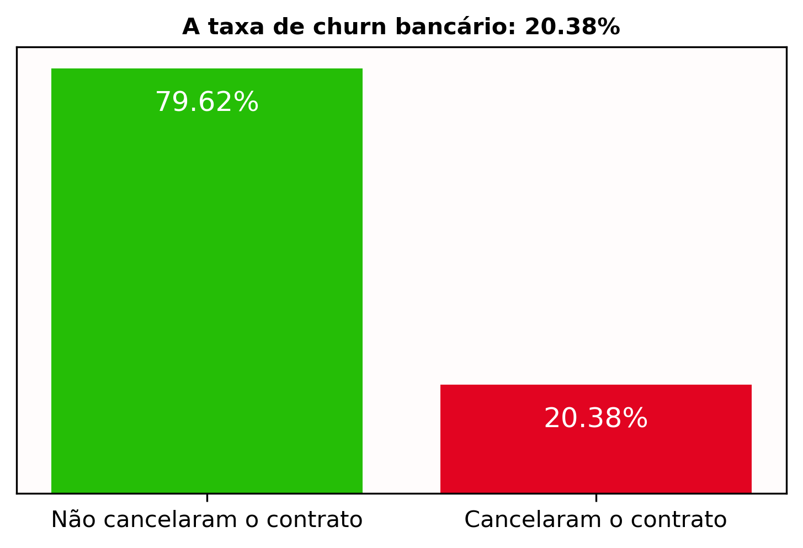
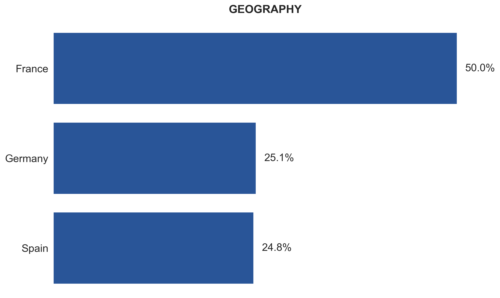
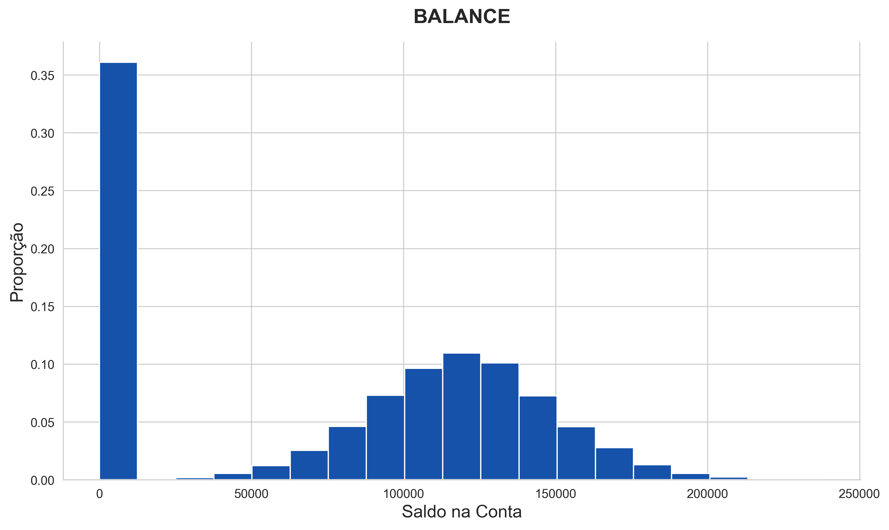
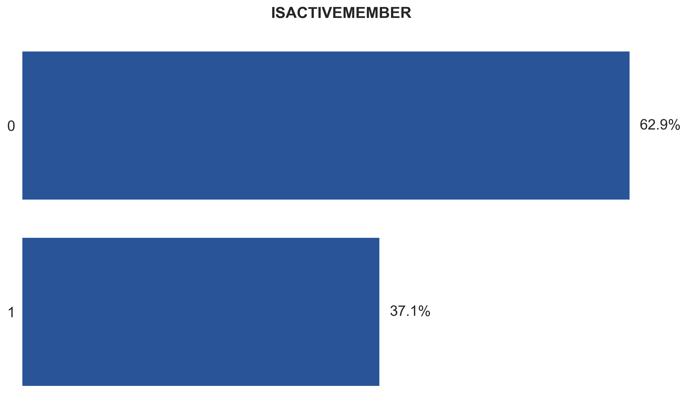
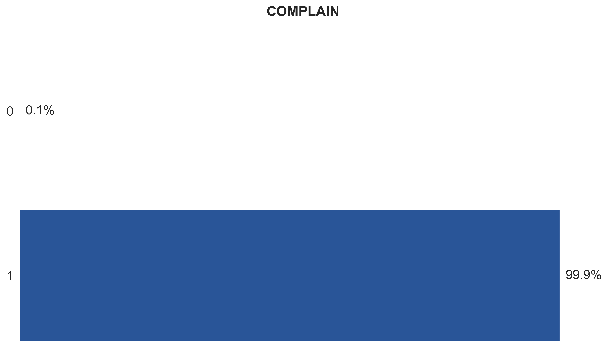
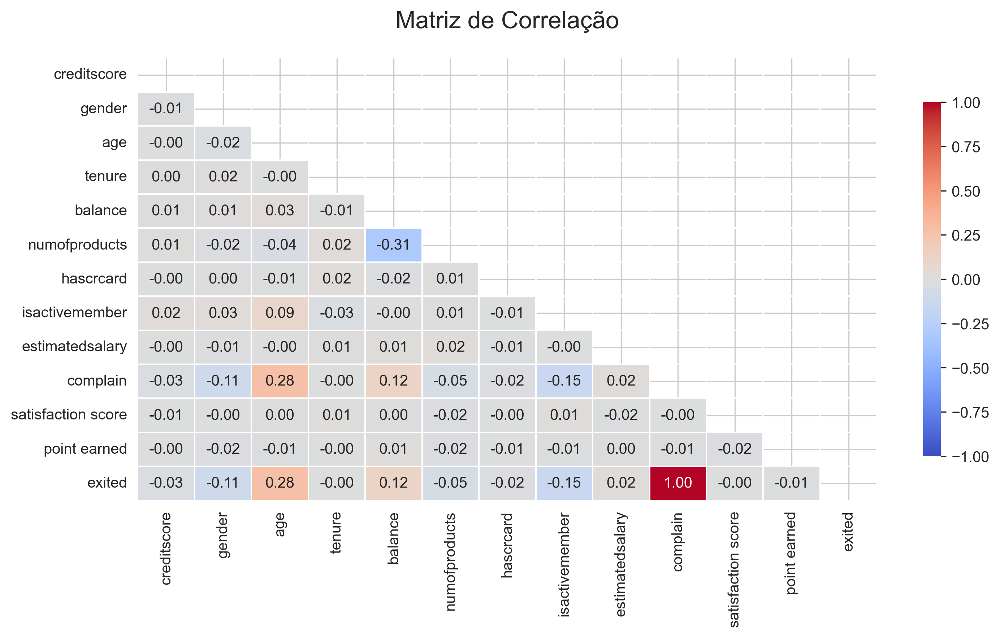
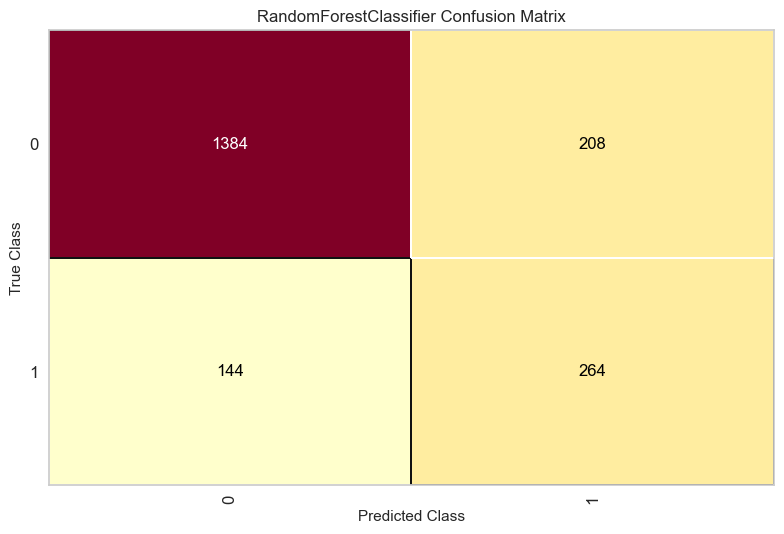

# Previsão de Churn Bancário com Machine Learning

Este projeto apresenta uma solução de aprendizado de máquina para previsão de cancelamento de contrato bancário, utilizando dados demográficos, financeiros e comportamentais para identificar clientes com maior probabilidade de cancelar seus contrato. Durante a análise exploratória dos dados (EDA), foram identificados padrões importantes relacionados ao churn, como maior incidência entre clientes inativos, com poucos produtos bancários e faixas etárias mais elevadas.

Foram avaliados diversos algoritmos de machine learning, incluindo Regressão Logística, Naive Bayes, KNN, Árvores de Decisão, Random Forest, Gradient Boosting, AdaBoost, XGBoost e LightGBM. Os melhores resultados foram obtidos pelos modelos ensemble baseados em árvores, com destaque para o Random Forest, que alcançou aproximadamente 82,8% de acurácia e apresentou o melhor equilíbrio entre as métricas de avaliação.

O projeto foi desenvolvido seguindo uma abordagem de ponta a ponta, desde a análise exploratória até o treinamento e avaliação dos modelos. A implementação foi organizada de forma modular, com pipelines para treinamento e previsão, além da utilização de boas práticas como ambientes virtuais, tratamento de exceções, geração de logs e documentação do código, ambas as etapas foram desenvolvidas em Jupyter Notebook.

# Tecnologias utilizadas

A ferramentas utilizadas neste projeto foram Python em conjunto com as bibliotecas e funções Pandas, NumPy, Matplotlib, Seaborn, Scikit-Learn, Imbalanced-Learn, XGBoost, LightGBM e Yellowbrick, Jupyter Notebook para análise exploratória e desenvolvimento dos modelos, algoritmos de classificação e clustering de aprendizado de máquina, técnicas estatísticas para análise dos dados, Git e GitHub para controle de versão, além do VS Code para desenvolvimento do projeto.

# Problema de Negócio

No setor bancário, a retenção de clientes representa um dos principais desafios estratégicos das instituições financeiras. O aumento da competitividade entre bancos tradicionais e bancos digitais ampliou as opções disponíveis para os consumidores, tornando o cancelamento de contratos (churn) um problema cada vez mais relevante. Nesse contexto, compreender os fatores que levam um cliente a encerrar seu relacionamento com o banco é fundamental para reduzir perdas financeiras e aumentar a fidelização.

A perda de clientes impacta diretamente indicadores importantes do negócio:

- O Custo de Aquisição de Clientes representa o valor investido pela instituição para conquistar novos clientes, incluindo despesas com marketing, vendas e campanhas de captação. Quando um cliente cancela seu contrato, parte desse investimento pode não gerar o retorno esperado, aumentando os custos operacionais da empresa.

- Já o Valor Vitalício do Cliente corresponde ao valor financeiro que um cliente pode gerar para o banco ao longo de todo o seu relacionamento com a instituição. Clientes com maior tempo de permanência tendem a consumir mais produtos e serviços financeiros, como cartões de crédito, empréstimos, seguros e investimentos. Dessa forma, reduzir a evasão de clientes contribui diretamente para o aumento valor vitalício do cliente. 

- Outro indicador fundamental é a Taxa de Cancelamento, que mede a proporção de clientes que encerraram seu vínculo com o banco em determinado período. Taxas elevadas dessa métrica podem indicar problemas relacionados à satisfação dos clientes, qualidade dos serviços, concorrência ou estratégias de relacionamento. 

Diante desse cenário, técnicas de machine learning podem auxiliar na identificação de padrões associados ao cancelamento de contratos, permitindo que o banco antecipe comportamentos de evasão e desenvolva ações preventivas para retenção de clientes.

# Objetivos do Projeto

O presente projeto possui como objetivo principal desenvolver modelos supervisionados de machine learning capazes de prever a probabilidade de cancelamento de clientes bancários com base em características presentes no conjunto de dados.

Entre os objetivos específicos do projeto, destacam-se:

- Identificar os principais fatores relacionados ao cancelamento de clientes.
- Realizar análises exploratórias para compreender o comportamento dos dados.
- Construir e treinar modelos preditivos para classificação de clientes.
- Avaliar o desempenho dos modelos utilizando métricas apropriadas.
- Comparar os resultados obtidos entre os modelos desenvolvidos.
- Auxiliar na geração de insights estratégicos para retenção de clientes e redução da taxa de churn.

A aplicação de modelos preditivos de churn permite ao banco identificar clientes com maior probabilidade de cancelamento, possibilitando ações preventivas de retenção. Com isso, a instituição pode reduzir perdas financeiras, aumentar a fidelização dos clientes e otimizar investimentos relacionados ao custo de aquisição de clientes. Além disso, a redução da evasão contribui diretamente para o aumento do valor vitalício do cliente e para a melhoria da eficiência estratégica do negócio.

# Etapas de desenvolvimento do projeto

Para o desenvolvimento deste projeto, será adotado o seguinte fluxo de etapas:

- Apresentação da problemática relacionada ao cancelamento de contratos bancários.
- Compreensão e análise das características do conjunto de dados fornecido pelo banco.
- Divisão dos dados em conjuntos de treino e teste.
- Realização da análise exploratória dos dados (EDA).
- Treinamento dos modelos de machine learning.
- Avaliação do desempenho dos modelos ajustados.
- Comparação dos resultados e escolha do modelo com melhor desempenho.

# Dicionário dos dados

**RowNumber:** Corresponde ao número do registro. Variável quantitativa discreta.
**CustomerId:** Representa o código de registro do cliente. Variável quantitativa discreta.
**Surname:** O sobrenome do cliente. Variável categórica nominal.
**CreditScore:** O escore do cartão de cédito do cliente. Variável quantitativa discreta.
**Geography:** A localização do cliente. Variável categórica nominal.
**Gender:** O gênero do cliente. Variável categórica nominal.
**Age:** Idade do cliente. Variável quantitativa discreta.
**Tenure:** Número de anos em que o cliente permanece no banco. Variável quantitativa discreta.
**Balance:** Saldo bancário do cliente. Variável quantitativa contínua.
**NumOfProducts:** Quantidade de produtos bancários adquiridos pelo cliente. Variável quantitativa discreta.
**HasCrCard:** Indica se o cliente possui cartão de crédito. 1 = Sim e 0 = Não. Variável categórica binária.
**IsActiveMember:** Indica se o cliente é um membro ativo. 1 = Sim e 0 = Não. Variável categórica binária.
**EstimatedSalary:** Salário estimado do cliente. Variável quantitativa contínua.
**Exited:** Indica se o cliente deixou o banco. 1 = Saiu e 0 = Permaneceu. Variável alvo do conjunto de dados. Variável categórica binária.
**Complain:** Indica se o cliente realizou alguma reclamação. 1 = Sim e 0 = Não. Variável categórica binária
**Satisfaction Score:** Nota de satisfação dada pelo cliente após resolução da reclamação. Variável categórica ordinal. 
**Card Type:** tipo de cartão que o cliente possui. Variável categórica ordinal. 
**Points Earned:** pontos acumulados pelo cliente pelo uso do cartão de crédito. Variável quantitativa discreta.

# Principas descobertas do projeto
  
- O gráfico demonstra que a maioria dos clientes permaneceu no banco, representando aproximadamente 79,62% da base de dados, enquanto cerca de 20,38% realizaram o cancelamento dos serviços bancários. Esses resultados evidenciam um desbalanceamento entre as classes, característica comum em problemas de churn e que deve ser considerada durante o treinamento dos modelos de machine learning.

 

- A análise geográfica revela que a operação do banco é fortemente dominada pela França, que concentra exatamente metade de toda a base de clientes (50%). A outra metade do portfólio divide-se de maneira quase perfeitamente simétrica entre os mercados secundários da Alemanha (25,1%) e da Espanha (24,8%).

 

- A distribuição do saldo bancário revela uma dualidade na base: mais de 35% dos clientes possuem a conta completamente zerada. Para o restante do portfólio, os valores seguem uma distribuição normal, com a grande maioria concentrando saldos entre 100 mil e 125 mil.

 

- O cruzamento de dados revela que clientes mais jovens 30 a 40 anos apresentam maior taxa de retenção no banco. Em contrapartida, o volume de cancelamentos concentra-se expressivamente em uma faixa etária mais madura, com um forte pico de evasão entre os 40 e 50 anos de idade.

 

- A análise do grupo evadido revela que a inatividade é um forte sintoma de cancelamento equivalente a 62,9% dos clientes que cancelaram não eram membros ativos. Isso demonstra que a falta de engajamento prévio com os serviços do banco atua como um claro estágio preparatório para a saída definitiva.

 

- A análise do grupo evadido revela uma estatística contundente 99,9% dos clientes que cancelaram o contrato haviam registrado alguma reclamação. Isso evidencia uma correlação quase absoluta entre a insatisfação formalizada e o cancelamento, comprovando visualmente o vazamento de dados que justificou a exclusão desta variável da modelagem preditiva.

 

- **Vazamento de Dados:** A correlação perfeita de 1.00 entre complain e a variável alvo exited é o maior destaque da matriz. Isso sinaliza um claro vazamento de dados, confirmando que a reclamação é quase um sinônimo da saída do cliente, o que torna obrigatória a remoção dessa feature para o treinamento do modelo.

- **Idade como Fator de Risco:** Existe uma correlação positiva moderada de 0.28 entre age e exited. Isso valida matematicamente o que foi visto no gráfico bivariado: o avanço da idade do cliente nesta base de dados está associado a uma maior tendência de cancelamento do contrato com o banco.

- **O Papel do Engajamento:** A variável isactivemember apresenta uma correlação negativa de -0.15 com a variável exited. Essa relação matemática comprova que manter o cliente como um membro ativo ajuda a reduzir a probabilidade de evasão.

- **Relação entre Produtos e Saldo:** Olhando apenas para as variáveis preditoras, nota-se uma correlação negativa de -0.31 entre balance e numofproducts. Isso revela um padrão de comportamento que clientes que adquirem mais produtos bancários tendem a manter saldos menores em suas contas.

- **Baixa Correlação Linear Geral:** A grande maioria das variáveis contínuas e discretas como creditscore, tenure, estimatedsalary e point earned possui correlações muito próximas a 0.00 com o churn. Isso indica a ausência de relações lineares diretas, justificando perfeitamente a sua escolha por modelos não-lineares, como Árvores de Decisão e floresta aleatória para capturar padrões mais complexos.

 

# Modelagem

Nesta etapa, o foco foi preparar os dados e construir um pipeline robusto para prever com precisão o churn de clientes. O processo foi estruturado em quatro etapas fundamentais:

- **Seleção de Features:** Removemos identificadores pessoais (RowNumber, CustomerId, Surname) que não possuem poder preditivo, além da variável Complain para evitar o vazamento de dados, garantindo que o modelo aprenda padrões comportamentais reais.

- **Pré-processamento:** Adequamos os dados às exigências matemáticas dos algoritmos utilizando OneHotEncoder para converter variáveis categóricas em binárias e StandardScaler para padronizar as variáveis numéricas.

- **Balanceamento de Classes:** Para lidar com o forte desbalanceamento da nossa variável alvo, aplicamos a técnica RandomOverSampler, permitindo que o modelo aprendesse a detectar os cancelamentos com maior eficácia.

- **Treinamento de Modelos:** Desenvolvemos e comparamos um amplo leque de algoritmos para encontrar a melhor performance. Testamos desde abordagens lineares e de distância Regressão Logística, KNN, Naive Bayes, até métodos avançados baseados em árvores e Ensemble/Boosting Decision Tree, Random Forest, AdaBoost, Gradient Boosting, XGBoost, LightGBM, além de explorar a clusterização com K-Means.

| Model               | Accuracy | Precision | Recall | F1-Score |
|---------------------|----------|-----------|--------|----------|
| Decision Tree       | 0.788    | 0.490     | 0.680  | 0.570    |
| Random Forest       | 0.828    | 0.570     | 0.660  | 0.610    |
| Logistic Regression | 0.699    | 0.370     | 0.700  | 0.490    |
| Gradient Boosting   | 0.812    | 0.530     | 0.720  | 0.610    |
| AdaBoost            | 0.783    | 0.480     | 0.740  | 0.580    |
| XGB                 | 0.827    | 0.580     | 0.550  | 0.570    |
|LightGBM             | 0.806    | 0.520     | 0.720  | 0.600    |
| K-Neighbors         | 0.702    | 0.360     | 0.610  | 0.450    |
| K-Means             | 0.712    | -         | -      | -        |
| Naive Bayes         | 0.725    | 0.400     | 0.680  | 0.500    |

Após o treino e avaliação de diversos algoritmos, os modelos Ensemble baseados em múltiplas árvores de decisão demonstraram ser os mais adequados para captar os padrões complexos e não-lineares de churn dos clientes. O grande destaque do projeto foi o Random Forest, eleito o melhor modelo global por alcançar a maior Acurácia 82,86%, garantindo uma elevada confiabilidade ao sinalizar potenciais cancelamentos com uma baixa taxa de falsos positivos. Como alternativas robustas, o Gradient Boosting obteve o maior F1-Score da análise, oferecendo um excelente equilíbrio geral, enquanto a AdaBoost isolada registou o maior Recall, sendo a opção ideal caso a prioridade de negócio fosse detetar absolutamente todas as evasões, mesmo à custa de mais falsos alarmes. Em contrapartida, algoritmos lineares e probabilísticos, como a Regressão Logística e o Naive Bayes, apresentaram os piores desempenhos. Isto confirma de forma clara que o comportamento que leva ao churn bancário é estritamente multifatorial e exige o poder matemático avançado de métodos como Bagging e Boosting para ser previsto com eficácia.

 

- Eficácia na retenção (Verdadeiros Positivos): O modelo deteta com grande eficácia os clientes prestes a cancelar, permitindo ao banco atuar no momento corrento para não perder o cliente.

- Poupança de recursos (Verdadeiros Negativos): A elevada capacidade de identificar os clientes fiéis garante que não se desperdiçam recursos de marketing com quem não tenciona sair.

- Elevado ROI (Falsos Positivos): A baixíssima taxa de falsos alarmes assegura que os investimentos em ofertas de retenção são direcionados com precisão, maximizando o retorno.

- Risco minimizado (Falsos Negativos): Embora alguns cancelamentos não sejam previstos, o balanceamento de dados reduziu esta falha, resultando num modelo conservador e altamente fiável para o negócio.

|Variável	        | Importância |
|-------------------|-------------|
|age	            |   0.327     |
|numofproducts	    |   0.200     |
|balance	        |   0.096     |
|estimatedsalary	|   0.063     |
|point earned	    |   0.062     |
|creditscore	    |   0.061     |
|isactivemember	    |   0.050     |
|geography_Germany  |   0.033     |
|tenure	            |   0.033     |
|satisfaction score	|   0.021     |

A análise revelou que a Idade 32,7% e o Número de Produtos 19,9% são os fatores mais decisivos para a evasão de clientes, concentrando mais da metade do poder preditivo do modelo. Fatores secundários como o Saldo Bancário 9,5% e o status de Membro Ativo 5,0% exercem uma influência moderada, enquanto o tipo ou a posse de cartão de crédito mostraram-se irrelevantes < 1%. Estrategicamente, as ações de retenção do banco devem focar na faixa etária de maior risco e no incentivo à contratação de múltiplos produtos, evitando o desperdício de campanhas focadas apenas em benefícios de cartão.

